# Project owner
Aadish Deshpande (deshpande.aa@northeastern.edu)

# Project Readme

## Brief overview of the project
* This project comes with 2 separate clients and 2 separate servers, for TCP and
UDP each
* There are 2 separate packages, for `Client` and `Server`

### Sample configuration

#### Project structure
* The following is our project structure.
```bash
.
├── README.md
└── src
    ├── Client
    │   ├── AbstractClient.java
    │   ├── ClientAppTCP.java
    │   ├── ClientAppUDP.java
    │   ├── IClient.java
    │   ├── TCPClient.java
    │   └── UDPClient.java
    ├── ExecutiveSummary.txt
    └── Server
        ├── AbstractServer.java
        ├── DataStore.java
        ├── IDataStore.java
        ├── IServer.java
        ├── ServerAppTCP.java
        ├── ServerAppUDP.java
        ├── TCPServer.java
        └── UDPServer.java
```
* Compile the code using `javac Server/*.java Client/*.java`
* To run the 
  * TCP server `java server/ServerAppTCP <tcp-port-number>`
  * UDP server `java server/ServerAppUDP <udp-port-number>`
* To run the 
  * TCP client `java client/ClientAppTCP <host-name> <port-number>`
  * UDP client `java client/ClientAppUDP <host-name> <port-number>`
* TCP client communicates with TCP server and UDP client communicates with UDP server
* All the client and server logs are generated on the console

## Executive Summary

### Assignment Overview:
The purpose of this assignment was to get a deeper understanding of underlying network protocols and 
explore and learn to use programming language based abstractions for implementing these
protocols. Implementing a single threaded server helped to focus on and understand the technical nuances 
associated with UDP packet handling, packet losses and malformed request. The assignment helped
focus on the technical differences in the implementations of TCP and UDP protocols, error handling 
logging mechanisms, which help in troubleshooting any application level issues by writing logs in
human-readable formats.

### Technical impressions and supporting new operations:

TCP protocol being connection oriented makes it easy for application programming, in
the sense, as a programmer I don't have to bother about handling sessions, managing connections, 
account for missing packages, etc. as this is already being taken care of. Thus, implementation wise,
TCP based client-server interaction is relatively straightforward. Although proper error handling, 
timeout mechanism using socket operations were needed to be implemented for robust communication 
between TCP based client and server.

Handling state-altering operations like DELETE ALL and GET ALL were relatively easier to implement
as there was no need to check any packet losses during transmission or reliability of network 
communication. In addition, TCP does support transmission of arbitrarily large streams of data, hence
it is much more straightforward. For supporting large streams, in case of network transmission failures,
there are sufficient safeguards and error logging.

UDP protocol on the other hand, involves a lot of things like handling and reporting missing packets, 
out of order delivery and malformed packets. A mechanism for determining the packet ordering, 
by using checksums was implemented. Packet data is used, along with a random uuid for generating unique checksums for 
any types of requests to generate the request id. This request ID is then used to verify the packet ordering
and sequencing. The reason to use a uuid was to avoid collisions in checksum generation in the event
of same request being sent twice.

For GET ALL, especially when transmitting large set of data, I initially considered splitting the 
data into chunks and sending them as separate datagram packets holding a few number of key value 
pairs, However, I wanted to avoid the associated pitfalls of splitting incorrectly some data chunks at 
the partition of packets. I then considered sending each key value pair as a response to the client. 
This ensures arbitrarily any number of key value entries being transmitted without any packet losses and minimal integrity issues. 
The amount of packets that are supposed to arrive from the server and the actual number of packets(key value pairs) 
are logged on the client side on console. Delete all operation results in the clearing of data store.
The data store returns appropriate response when it is empty so that server sends adequate response.

Identifying any packet losses first and then logging them was a challenge. In addition, buffers 
had to be carefully utilized in order to avoid any potential issues with improper usage, such as 
improper sequencing, overflows or incorrect parsing.

### Practical Applications:
1. a “web server” which can be used to handle HTTP requests. 
2. “financial trading systems” where there is one server to handle the trade and market data requests of clients to ensure timely and accurate transactions.
3. TCP based application can be used as a file server which handles reliable communication for sending and
   receiving files across network. UDP based applications can be used in streaming live data transmission.

# Output and Screenshots

## TCP

Get responses
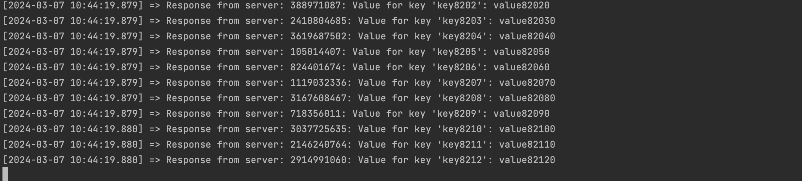

Portion of Get all response
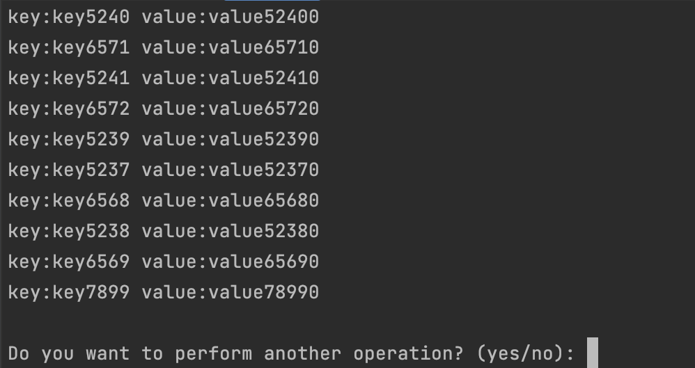

Adding a key to the store
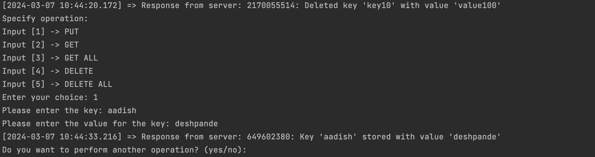

Delete All
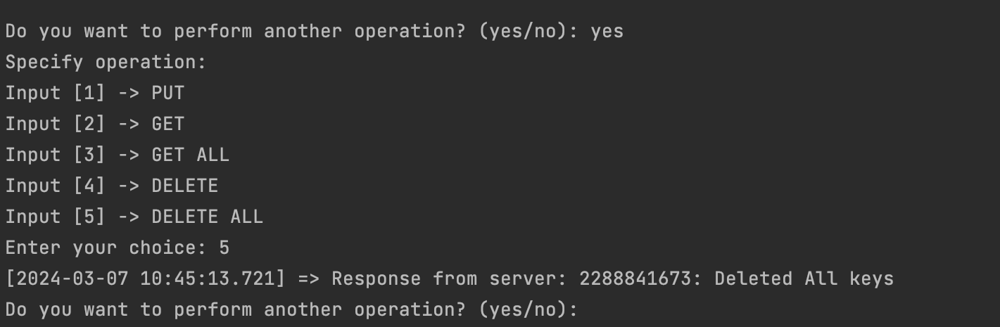

Get all after delete
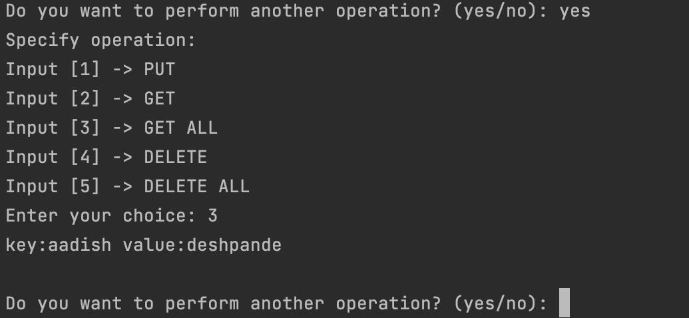

Server Logs
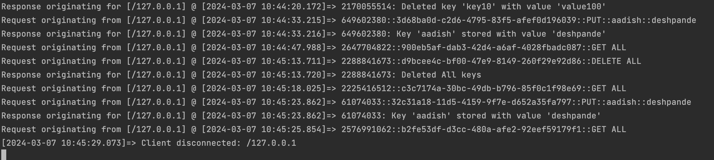


## UDP

UDP Server
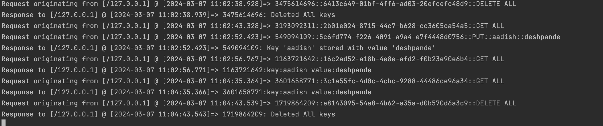

UDP Get all with some packet loss
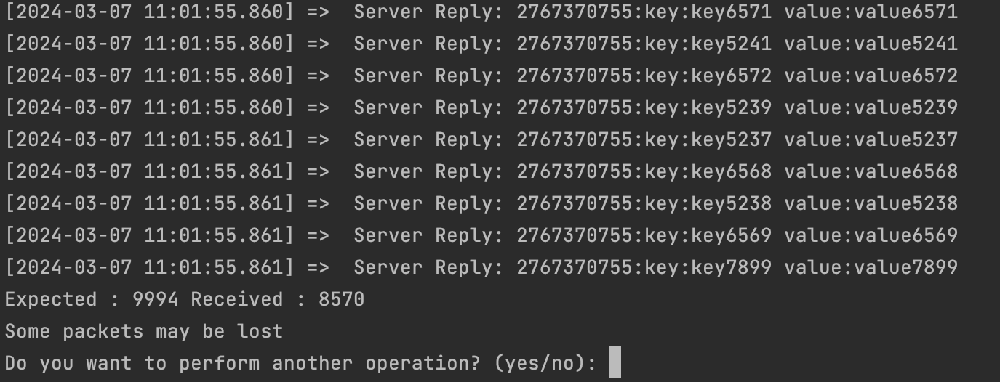

UDP Delete all operation
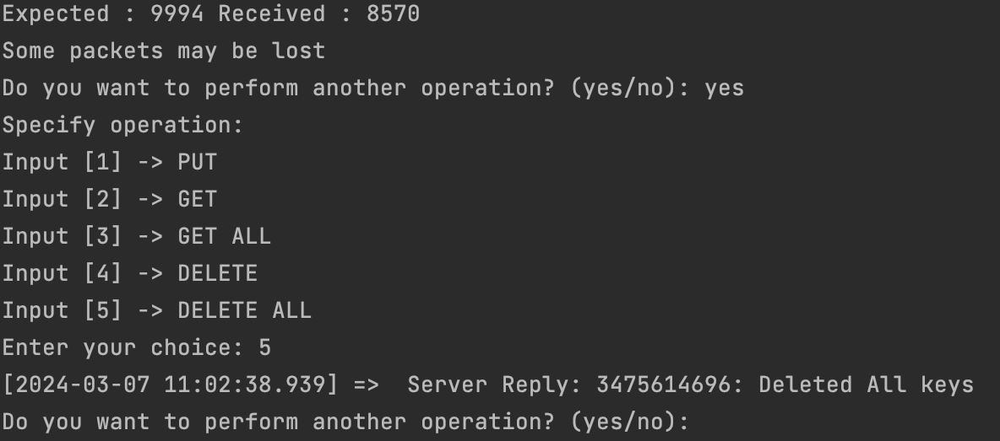

Get all after delete all
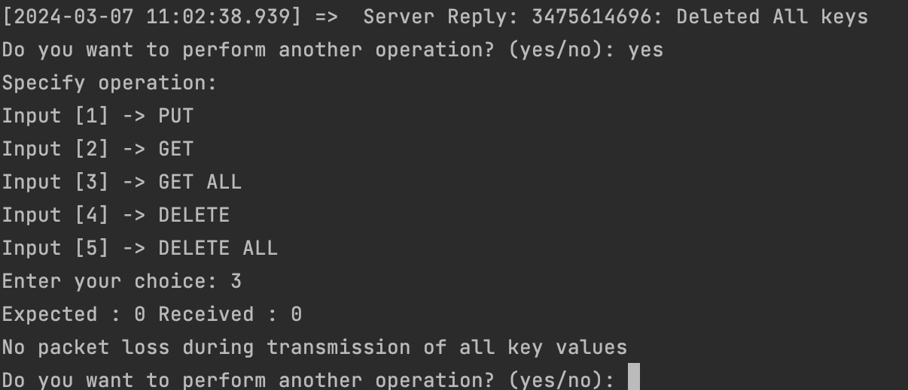

Inserting into empty store
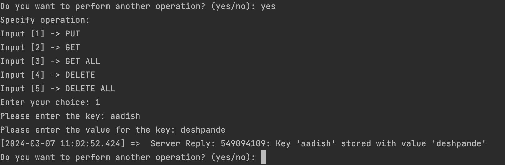

Get all again
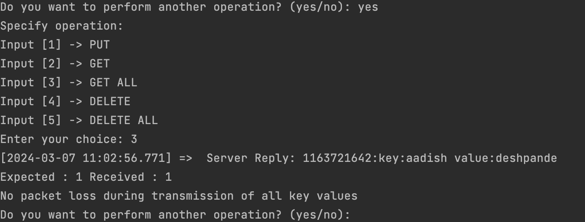